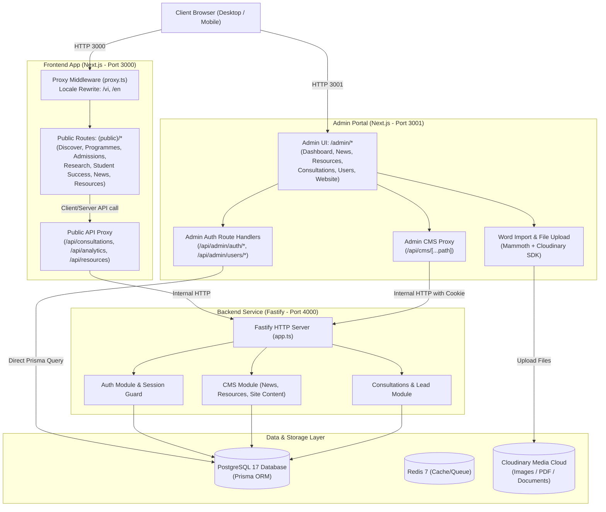
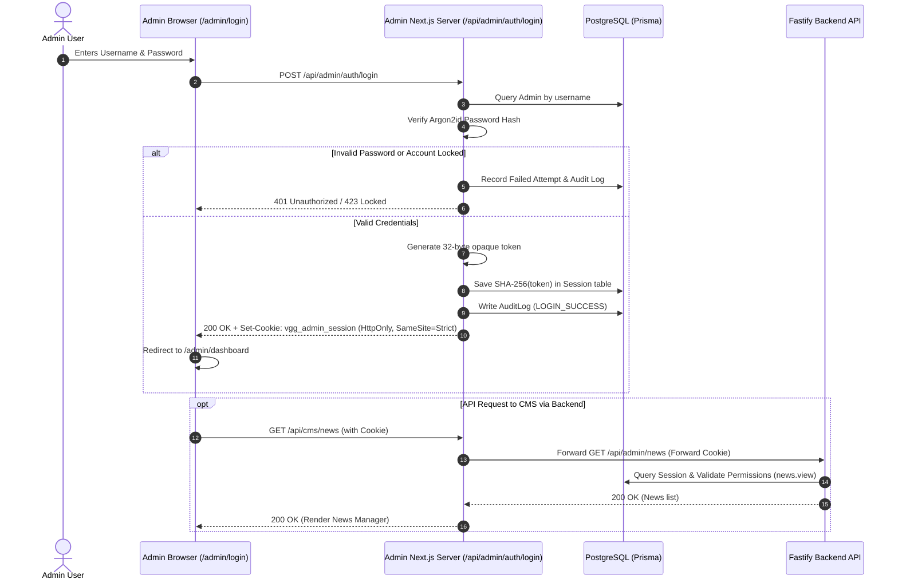
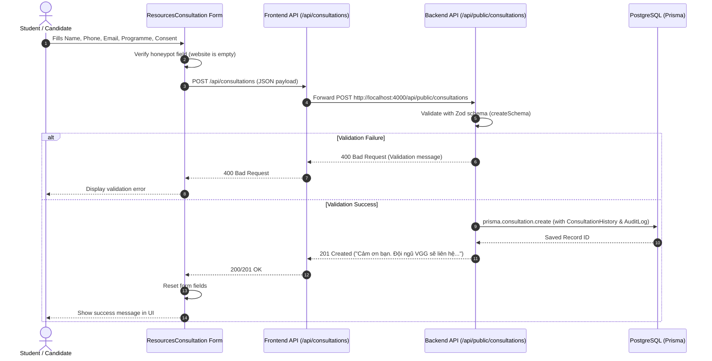
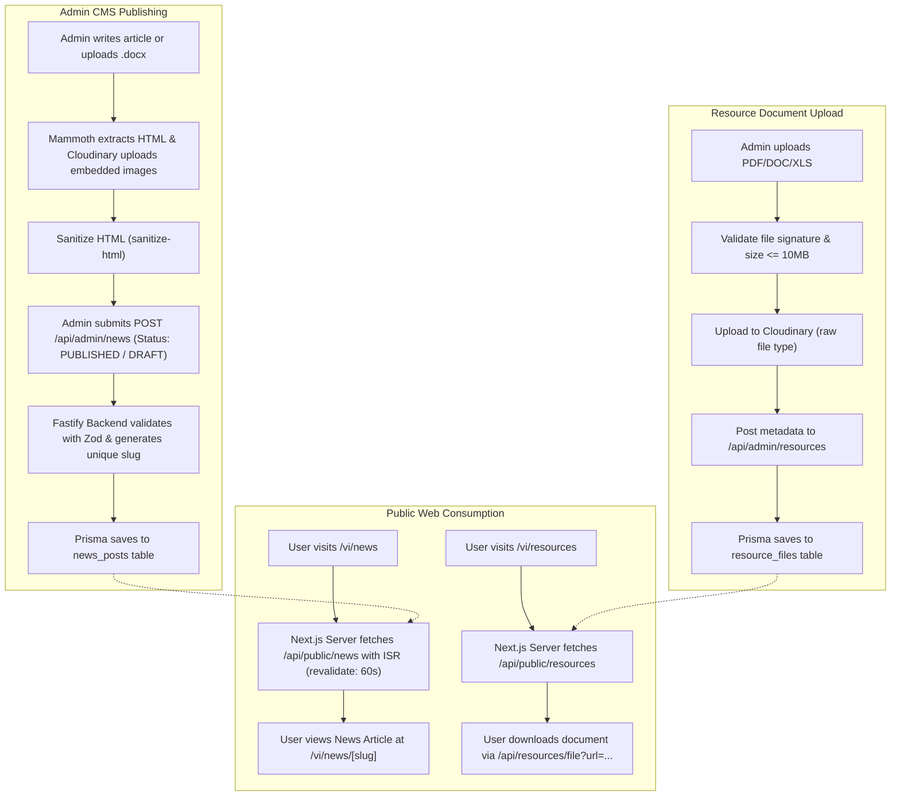
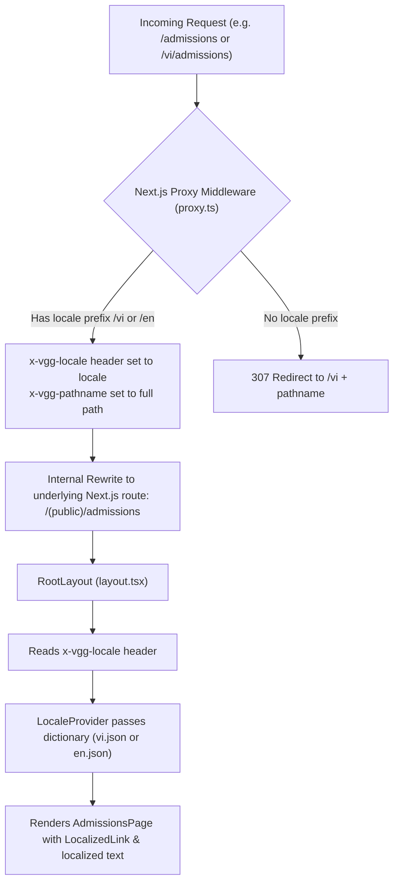

# Architecture & Flow Maps: VGG Platform

This document outlines the visual system architecture, authentication mechanisms, data flows, and routing behavior of the VGG Platform.

---

## 1. System Architecture Map

---

## 2. Authentication & Protected Route Flow

---

## 3. Public Consultation Form Data Flow

---

## 4. News & Resource Document Lifecycle

---

## 5. Localization & Routing Flow

