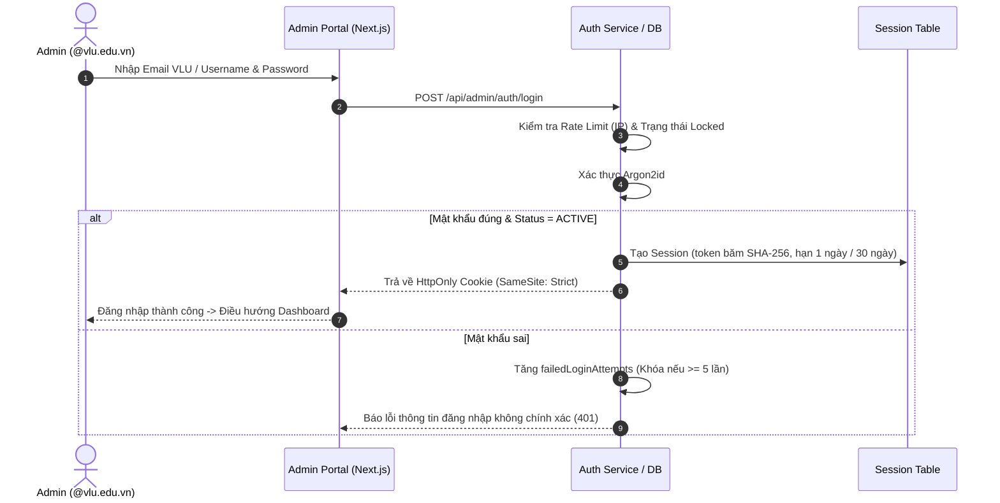
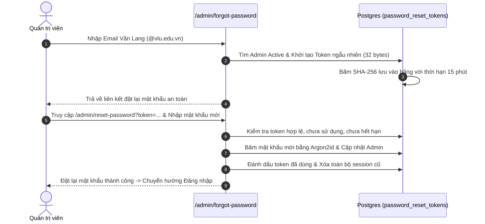

# 02. TÀI LIỆU KIẾN TRÚC HỆ THỐNG (SYSTEM ARCHITECTURE)

## 1. Sơ Đồ Kiến Trúc Tổng Thể (System Architecture)

```mermaid
flowchart TD
    subgraph Clients["TẦNG NGƯỜI DÙNG & QUẢN TRỊ"]
        User["🌐 Khách truy cập (Public Users)"]
        AdminUser["🛡️ Quản trị viên (Super Admin / QTV Cấp 2)"]
    end

    subgraph ReverseProxy["TẦNG GATEWAY & REVERSE PROXY"]
        Nginx["Nginx / Cloudflare (SSL / TLS 1.3 Termination, Gzip/Brotli)"]
    end

    subgraph Applications["TẦNG ỨNG DỤNG (NODE.JS 22 LTS)"]
        FE["Frontend Website (Next.js 16 - Port 3000)<br/>• SSR / Static Generation<br/>• Song ngữ VI/EN<br/>• Form tư vấn tuyển sinh"]
        AdminApp["Admin Portal (Next.js 16 - Port 3001)<br/>• CMS Dashboard<br/>• Quản lý Nhân sự & Phân quyền<br/>• Thông báo Realtime"]
        API["Backend API Service (Fastify - Port 4000)<br/>• Zod Request Validation<br/>• Argon2id Security & Auth<br/>• Sanitize-HTML (Anti-XSS)<br/>• Rate Limiting"]
    end

    subgraph DataStorage["TẦNG LƯU TRỮ DỮ LIỆU"]
        Postgres[("PostgreSQL 17 Database<br/>• 25+ Indices<br/>• Foreign Key Cascades<br/>• Audit Logs & Sessions")]
        Redis[("Redis 7 (Optional)<br/>• Session Cache & Rate Limit")]
        Storage["Storage (MinIO / Local / Cloudinary)<br/>• PDF, DOCX, Media Assets"]
    end

    User -->|HTTPS :443| Nginx
    AdminUser -->|HTTPS :443| Nginx
    Nginx -->|Proxy /| FE
    Nginx -->|Proxy /admin| AdminApp
    FE -->|SSR Internal HTTP :4000| API
    AdminApp -->|Proxy & API HTTP :4000| API
    AdminApp -->|Prisma Client| Postgres
    API -->|Prisma ORM (Connection Pool)| Postgres
    API -.->|Cache| Redis
    API -->|Uploads| Storage
    AdminApp -->|Uploads| Storage
```

---

## 2. Kiến Trúc Xác Thực & Phân Quyền (Authentication & RBAC)

Hệ thống sử dụng cơ chế xác thực bảo mật nhiều lớp:
1. **Băm mật khẩu:** Thuật toán **Argon2id** với thông số tiêu chuẩn an toàn cao (`memoryCost: 65536` - 64MB, `timeCost: 3`, `parallelism: 1`). Chống lại các cuộc tấn công Brute-force và Dictionary Attack bằng GPU.
2. **Quản lý Phiên (Session Management):** Token ngẫu nhiên cryptographically secure (32 bytes) được băm một chiều **SHA-256** trước khi lưu vào bảng `admin_sessions`.
3. **Cookie bảo mật:** Cookie `vgg_admin_session` mang cờ `HttpOnly: true`, `SameSite: Strict`, và `Secure: true` trên môi trường Production (ngăn chặn đánh cắp qua JavaScript/XSS).
4. **Chống Tấn Công Dò Quét Thời Gian (Timing Attack Prevention):** Khi đăng nhập với tài khoản không tồn tại, hệ thống tự động băm một `DUMMY_HASH` để duy trì thời gian phản hồi đồng nhất, ngăn chặn dò quét username.
5. **Cơ Chế Khóa Tự Động (Account Lockout):** Tạm khóa tài khoản 15 phút nếu đăng nhập sai quá 5 lần liên tiếp.



---

## 3. Quy Trình Quên Mật Khẩu (Password Reset Flow)



---

## 4. Kiến Trúc Thông Báo Realtime & Nhật Ký Kiểm Toán (Audit Trail)

Mọi thao tác quản trị viên thực hiện (Tạo/Sửa/Xóa bài viết, tải biểu mẫu, cập nhật nhân sự, xử lý đơn tư vấn) đều được lưu trữ bất biến trong bảng `audit_logs`:
- **Realtime Polling:** Client Admin tự động gửi tín hiệu định kỳ mỗi 12 giây để nhận danh sách hoạt động mới nhất.
- **Phân loại sự kiện:** Phân luồng sự kiện theo danh mục (*Nhân sự*, *Nội dung CMS*, *Tư vấn tuyển sinh*, *Hệ thống*) giúp cán bộ nắm bắt luồng vận hành tức thì.
