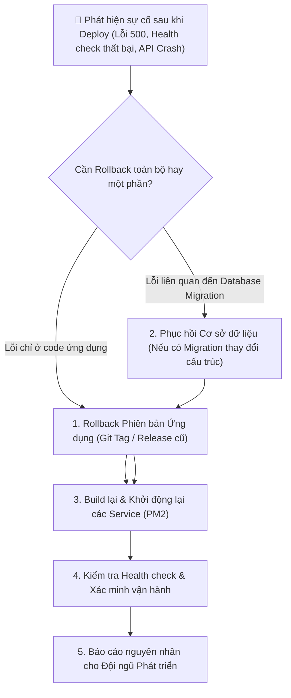

# 10. QUY TRÌNH ROLLBACK SỰ CỐ (ROLLBACK GUIDE)

Tài liệu này cung cấp phương án hành động khẩn cấp khi đợt triển khai phiên bản mới gặp sự cố hoặc không đạt tiêu chuẩn sau khi deploy lên Production.

---

## 1. Sơ Đồ Quy Trình Rollback (Rollback Flow)



---

## 2. Các Bước Rollback Ứng Dụng (Application Rollback)

### Bước 1: Chuyển mã nguồn về Git Tag hoặc Commit ổn định trước đó
```bash
cd /var/www/vgg-platform

# Xem danh sách các tag phiên bản ổn định
git tag -l

# Checkout về phiên bản ổn định trước đó (Ví dụ: v1.0.0)
git checkout v1.0.0
```

### Bước 2: Cài đặt lại dependencies và build lại ứng dụng
```bash
npm ci
npm run build
npm run build:admin
npm run build:backend
```

### Bước 3: Khởi động lại các tiến trình trên PM2
```bash
pm2 restart all
pm2 status
```

---

## 3. Rollback Cơ Sở Dữ Liệu (Database Rollback)

> ⚠️ **LƯU Ý:** Trước mỗi đợt deploy phiên bản mới có thay đổi database, IT **bắt buộc phải tạo bản sao lưu snapshot ngay trước khi chạy migration**.

Nếu phiên bản mới đã chạy migration làm thay đổi bảng nhưng bị lỗi:
```bash
# Phục hồi từ bản snapshot sao lưu tạo ngay trước khi deploy
gunzip -c /var/backups/vgg-platform/pre_deploy_backup.sql.gz | docker compose exec -T postgres psql -U vgg -d vgg
```

---

## 4. Xác Minh Sau Khi Rollback (Post-Rollback Verification)

- [ ] Kiểm tra Backend Health API: `curl -f http://127.0.0.1:4000/health` (phải trả về `HTTP 200 OK`).
- [ ] Kiểm tra trang chủ công khai: `https://vgg.vlu.edu.vn`.
- [ ] Kiểm tra cổng quản trị: `https://admin-vgg.vlu.edu.vn/admin/login`.
- [ ] Xem log lỗi PM2: `pm2 logs --lines 50`.
- [ ] Báo cáo log và thông tin lỗi cho Technical Lead / Developer để phân tích nguyên nhân gốc rễ (Root Cause Analysis - RCA).
